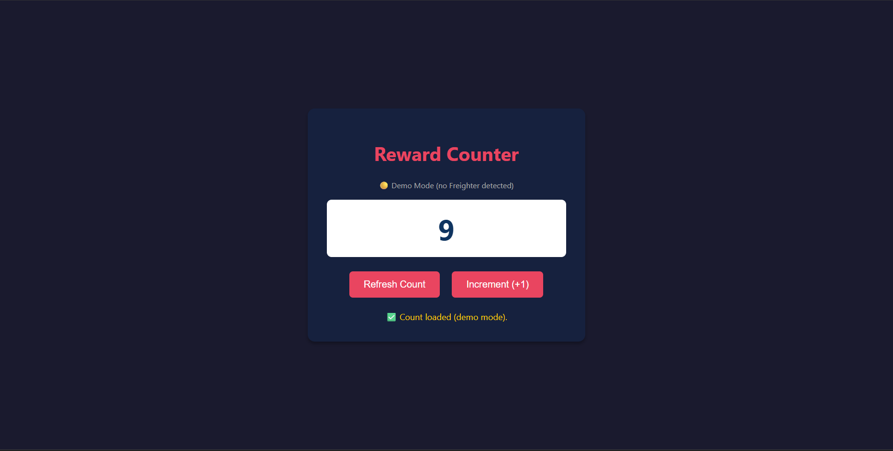
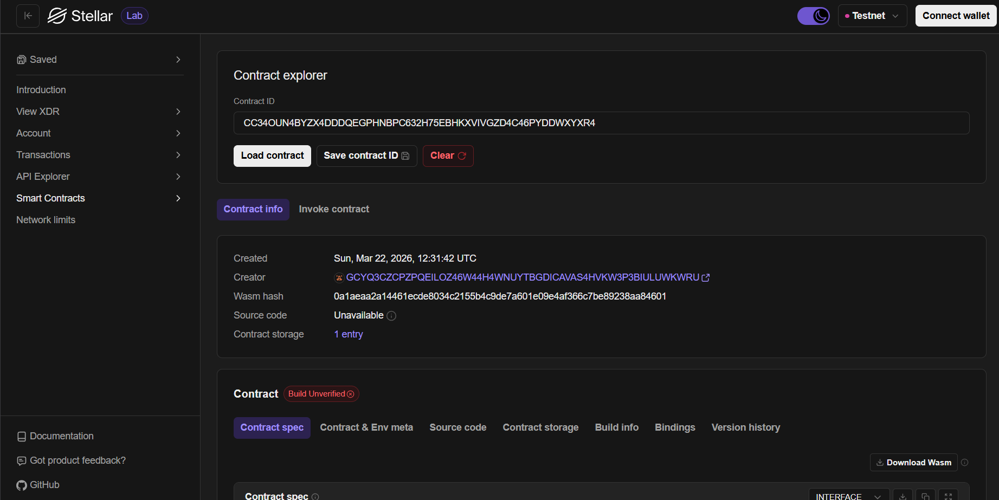

# Reward Counter 💸

A fully functional, decentralized Web3 application built on the Stellar Soroban blockchain. This dApp allows users to track a global on-chain counter, securely interacting with the testnet.

## Deployment Details

*   **Contract ID / Address:** `CC34OUN4BYZX4DDDQEGPHNBPC632H75EBHKXVIVGZD4C46PYDDWXYXR4a82e4ed3bc075c7c`
*   **Network:** Stellar Testnet

## Dashboard Preview



## Stellar Labs



## Features ✨

*   **Non-Custodial Wallet Integration:** Securely connect and sign transactions using the [Freighter Browser Extension](https://www.freighter.app/).
*   **On-Chain State Management:** The smart contract stores and increments a public counter.
*   **Real-time Ledger Interaction:** Read and write directly to the Stellar testnet with real-time feedback.
*   **Next.js Frontend:** A modern React-based frontend built with Next.js, TypeScript, and Tailwind CSS, integrating with `@stellar/stellar-sdk`.
*   **Demo Mode:** Automatically falls back to a local demo mode when Freighter is not installed, so the UI can still be explored.

## Project Architecture 🏗️

The project is divided into two main components:

1.  **Smart Contract (`/contracts/reward-counter`)**: Written in Rust using the Soroban SDK. It handles the core logic for the global counter.
2.  **Frontend (`/frontend`)**: A Next.js (React + TypeScript + Tailwind CSS) application that interacts with the deployed contract on the Soroban Testnet.

## Tech Stack

| Layer          | Technology                          |
| -------------- | ----------------------------------- |
| Smart Contract | Rust + Soroban SDK                  |
| Frontend       | Next.js, React 19, TypeScript       |
| Styling        | Tailwind CSS v4                     |
| Wallet         | Freighter Browser Extension         |
| Network        | Stellar Soroban Testnet             |

---

## Getting Started 🚀

### Prerequisites

*   [Node.js](https://nodejs.org/) (v18+)
*   [Rust](https://www.rust-lang.org/) (v1.94+)
*   [Stellar CLI](https://developers.stellar.org/docs/build/smart-contracts/getting-started/setup)
*   [Freighter Wallet Extension](https://www.freighter.app/) (optional — demo mode available without it)

### 1. Smart Contract

The contract is already deployed to the Stellar Testnet, but if you wish to deploy it yourself:

1. Navigate to the contract directory:
   ```bash
   cd contracts/reward-counter
   ```
2. Build the optimized `.wasm`:
   ```bash
   cargo build --target wasm32-unknown-unknown --release
   ```
3. Deploy the contract:
   ```bash
   stellar contract deploy \
       --wasm target/wasm32-unknown-unknown/release/reward_counter.wasm \
       --source my-wallet \
       --network testnet
   ```

### 2. Frontend Application

1. Navigate to the frontend directory:
   ```bash
   cd frontend
   ```
2. Install dependencies:
   ```bash
   npm install
   ```
3. Start the development server:
   ```bash
   npm run dev
   ```
4. Open your browser to `http://localhost:3000`.

### Connecting your Wallet

1. Install the Freighter extension.
2. Switch the Freighter network to **Testnet**.
3. Fund your Freighter wallet using the [Stellar Laboratory Friendbot](https://laboratory.stellar.org/#account-creator?network=test).
4. Click **Connect Freighter** in the dApp and approve the connection.
